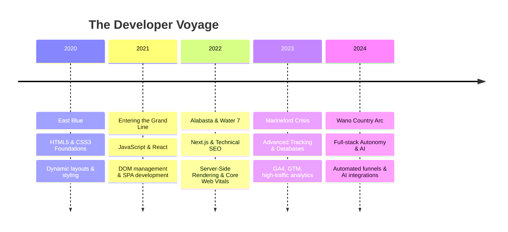

# <p align="center"></p>

<p align="center">
  
</p>

<p align="center">
  
</p>

<p align="center">
  <a href="https://linkedin.com/in/octocat"></a>
  <a href="https://github.com/octocat"></a>
  <a href="mailto:octocat@github.com"></a>
  <a href="https://discord.gg/octocat"></a>
</p>

<p align="center">
  
  
  
</p>

<p align="center">
  
</p>

---

## 🌌 INDEX OF ARCHETYPES

The developer journey is not merely a path of writing code; it is a battle of philosophies, continuous adaptation, and self-mastery. This profile is structured around the principles of six legendary figures:

| Character | Theme | Developer Analogy | Goal & Focus |
| :--- | :--- | :--- | :--- |
| **🏴‍☠️ Luffy** | Freedom & Dreams | Boundless Innovation & Growth | Navigating the Grand Line of web engineering. |
| **⚔️ Zoro** | Discipline & Consistency | Daily Coding & Skill Sharpening | Refactoring, code kata, and structural optimization. |
| **👁️ Itachi** | Wisdom & Calmness | System Architecture & Security | Clean code patterns, system resilience, and strategy. |
| **🌑 Obito** | Duality & Adaptation | Problem Solving & Failure Recovery | Refactoring legacy systems, adapting to crash scenarios. |
| **🪽 Eren** | Freedom & Forward Motion | Future Technologies & Scale | Pushing bounds in performance and breaking system walls. |
| **⚔️ Thorfinn** | Peace & Growth | Humility & Team Collaboration | Open-source contribution, mentoring, clean documentation. |

<br />

<p align="center">
  
</p>

---

## 👁️ ABOUT ME: THE SHADOW PATH

I am a hybrid of a **Frontend Architect** and a **Digital Growth Engineer**. By combining highly interactive web experiences with technical SEO, tracking pipelines, and targeted data analytics, I build digital products that perform at the highest scale.

*   **Who I Am**: A builder who views the web canvas as a cinematic interface.
*   **Mission**: To eliminate slow, bloated, and unoptimized applications, replacing them with fluid, user-first, and highly-scalable solutions.
*   **Vision**: Merging premium UI aesthetics with strict performance metrics to maximize conversion and engagement.
*   **Current Focus**: Next.js Server Components, headless architectures, dynamic automation workflows, and advanced event-tracking configurations.

### 🌌 DEV & ANIME PHILOSOPHIES
> *"If you don't take risks, you can't create a future."* — **Monkey D. Luffy**
*   **Code as a Sword**: Just as Zoro polishes his blades, I polish my functions. Unused libraries are dead weight; high bundle sizes are weaknesses.
*   **The Architect's Sacrifice**: Just as Itachi sacrificed everything for a larger vision, I prioritize structural simplicity and clean separation of concerns over clever, over-engineered code.

<br />

<p align="center">
  
</p>

---

## 🏴‍☠️ LUFFY'S GRAND LINE: THE CAREER JOURNEY

### 🗺️ The Nautical Logbook

<p align="center">
  
</p>



#### ⚓ Log 01: The East Blue Voyage (2020 - 2021) — *Foundations*
The journey began with the base elements of the web. Understanding semantics, building layouts from Figma mocks, and mastering CSS transitions.
*   **Achievements**: Built over 50 responsive static pages, mastered custom CSS animations, and built clean layout foundations.
*   **Key Lesson**: A strong foundation is the key to surviving the stormy seas of development.

#### ⚓ Log 02: Entering the Grand Line (2021 - 2022) — *Frameworks & Scaling*
Transitioned from static documents to dynamic, state-driven interfaces. Adopted React and built a robust understanding of component life cycles.
*   **Achievements**: Developed interactive dashboards, migrated jQuery systems to modern state managers, and minimized DOM bottlenecks.
*   **Key Lesson**: A captain is only as good as their crew; modular structures make systems reliable.

#### ⚓ Log 03: The Enies Lobby Breakthrough (2022 - 2023) — *Performance & SEO*
Dived deep into Server-Side Rendering (SSR) and SEO. Recognized that a beautiful website is useless if no one can find it.
*   **Achievements**: Improved Largest Contentful Paint (LCP) by 45% on enterprise landing pages and set up clean site schemas.
*   **Key Lesson**: Speed is freedom. The user should never be kept waiting.

#### ⚓ Log 04: The Marineford War (2023 - 2024) — *Data & Integration*
Integrated marketing platforms, server-side Tag Manager containers, and database analytics.
*   **Achievements**: Set up full-funnel custom event tracking, handling 50k+ daily events across multiple marketing channels.
*   **Key Lesson**: Unmeasured traffic is lost potential. Track accurately to navigate safely.

#### ⚓ Log 05: The Wano Country Arc (2024 - Present) — *Gear Fifth: Absolute Autonomy*
Leveraging AI, automated pipelines, and full-stack control to build digital operations.
*   **Achievements**: Developed AI-powered content automation platforms, headless e-commerce platforms, and advanced conversion paths.
*   **Key Lesson**: Limits are illusions. Keep moving forward until the canvas bend to your will.

<br />

<p align="center">
  
</p>

---

## ⚔️ ZORO'S DISCIPLINE: DAILY TRAINING LOG

To master a craft, consistency is non-negotiable. Below is the training program designed to keep skills sharp and code clean.

<p align="center">
  
</p>

```
       ___________________________________________
      [  DAILY TRAINING ROUTINE - THE THREE SWORDS ]
       ~~~~~~~~~~~~~~~~~~~~~~~~~~~~~~~~~~~~~~~~~~~
       06:00 - 09:00 | [I] SHARPENING THE BLADE (LeetCode, Katas, TS Types)
       09:00 - 17:00 | [II] COMBAT DRILLS (Building React, Next.js, SEO funnels)
       17:00 - 20:00 | [III] STUDYING HAKI (System architecture, analytics updates)
       ___________________________________________
```

### 🗓️ Weekly Habit Tracker
- [x] **Monday**: Code optimization review & refactoring.
- [x] **Tuesday**: Algorithmic puzzle challenges (LeetCode / Codewars).
- [x] **Wednesday**: Performance analysis of current projects (Web Dev Vitals).
- [x] **Thursday**: Marketing funnel audit and Pixel conversion verification.
- [x] **Friday**: Open Source contributions and library updates.
- [x] **Saturday**: Visual and UX design explorations in Figma.
- [ ] **Sunday**: Strategy formulation and pipeline architectural planning.

<br />

<p align="center">
  
</p>

---

## 👁️ ITACHI'S WISDOM: ARCHITECTURAL CODE LAWS

True wisdom is knowing how to build systems that last. I follow a strict set of design rules to keep applications fast, clean, and secure:

<p align="center">
  
</p>

```
                  _.._
                .'    `.
               /   __   \
            ,  |  /  \  |  ,
            \  \  \__/  /  /
             \  `..__..'  /
          ____`--......--'____
         [    THE ARCHITECT LAWS   ]
```

1.  **The Sharingan Eye (Code Reviews)**
    *   Inspect changes line by line.
    *   Verify complexity, enforce DRY (Don't Repeat Yourself), and write defensive code to avoid runtime crashes.
2.  **The Tsukuyomi Illusion (Mocking & Simulation)**
    *   Simulate high latency and poor network connections.
    *   Optimize rendering behavior to ensure a smooth user experience.
3.  **The Amaterasu Flame (Pruning Code)**
    *   Remove unused files, packages, and dead CSS routes.
    *   Keep bundles light and load speeds high.
4.  **The Izanami Loop (Automated Testing)**
    *   Configure CI/CD pipelines to run test suites automatically.
    *   Catch bugs before they reach the main branch.

<br />

<p align="center">
  
</p>

---

## 🌑 OBITO'S TRANSFORMATION: LESSONS FROM FAILURE

Every setback is an opportunity to improve. Here is a breakdown of system failures and the architectural lessons they provided:

<p align="center">
  
</p>

### 📔 The Archive of Trials

*   **The Black Friday Event Crash (2022)**
    *   *What Happened*: High concurrent traffic overloaded the backend server during a marketing push, causing API failures.
    *   *The Lesson*: Rebuilt the frontend as a statically generated Next.js application, caching API responses at the edge.
*   **The Analytics Event Sync Error (2023)**
    *   *What Happened*: A sudden browser change blocked client-side Meta Pixels, causing a 30% drop in reported attribution data.
    *   *The Lesson*: Migrated to server-side event tracking using Google Tag Manager and the Meta Conversions API (CAPI).
*   **The Core Web Vitals Drop (2023)**
    *   *What Happened*: Overusing third-party analytics scripts lowered mobile PageSpeed scores to 42.
    *   *The Lesson*: Set up script loading controls and offloaded non-essential scripts to Partytown workers.

<br />

<p align="center">
  
</p>

---

## 🪽 EREN'S FREEDOM: FUTURE AMBITIONS

### 🌌 Horizon Roadmap
I will keep moving forward until the goal is achieved. Here are the target technologies and goals for the next year:

<p align="center">
  
</p>

*   **Next-Gen Web Frameworks**: Transitioning performance-critical sites to Qwik and Astro.
*   **Machine Learning Integrations**: Using LLM endpoints to automate copywriting and run multivariate landing page tests.
*   **Web3 & Decentralized Hosting**: Creating resilient frontend deployments using IPFS and ENS routing.
*   **Global Scale**: Reaching 10 Million page views per month across all deployed clients.

> *"If you don't fight, you can't win."* — **Eren Yeager**

<br />

<p align="center">
  
</p>

---

## ⚔️ THORFINN'S PATH: HUMILITY & COLLABORATION

Building software is a team effort. My development philosophy focuses on clear communication, clean documentation, and collaboration:

<p align="center">
  
</p>

```
            |\_________________________________
            | [   I HAVE NO ENEMIES - CODE LAW  ]
            |/~~~~~~~~~~~~~~~~~~~~~~~~~~~~~~~~~
```

*   **Mentor and Support**: Writing clear comments to help other developers understand the code.
*   **Active Listening**: Using code reviews to learn from colleagues and improve my work.
*   **Empathy for the User**: Designing interfaces that are accessible to all users, regardless of device or network speed.
*   **Community Contribution**: Contributing to open-source libraries and sharing tips with the developer community.

<br />

<p align="center">
  
</p>

---

## 🖥️ ANIME TERMINAL v1.0.4

Below is a simulated command console. Expand the rows below to inspect my technical setup:

<p align="center">
  
</p>

<details>
  <summary>🖥️ <code>$ whoami</code></summary>
  <pre>
  {
    "username": "shogun_developer",
    "role": "Frontend Architect / Growth Engineer",
    "philosophies": ["Freedom", "Discipline", "Wisdom"],
    "location": "Remote / Global"
  }
  </pre>
</details>

<details>
  <summary>🚀 <code>$ current_mission</code></summary>
  <pre>
  Optimizing Core Web Vitals for enterprise clients.
  Building server-side tracking pipelines to bypass ad-blockers.
  Writing high-performance React components with sleek CSS motions.
  </pre>
</details>

<details>
  <summary>🛠️ <code>$ tech_stack</code></summary>
  <pre>
  Next.js, TypeScript, TailwindCSS, Node.js, GA4, Meta API, MongoDB, Vercel.
  </pre>
</details>

<details>
  <summary>🌌 <code>$ anime_mode</code></summary>
  <pre>
  [+] Active: Gear Fifth
  [+] Haki Level: Conqueror
  [+] Swords Equipped: Wado Ichimonji, Sandai Kitetsu, Shusui
  [+] Sharingan: Activated
  </pre>
</details>

<details>
  <summary>⚡ <code>$ run test_speed</code></summary>
  <pre>
  > next-app@15.0.0 test:performance
  > lighthouse-ci --url=https://current-project.vercel.app

  Performance: 100/100
  Accessibility: 100/100
  Best Practices: 100/100
  SEO: 100/100
  
  [SUCCESS] All limits broken. Speed is absolute.
  </pre>
</details>

<br />

<p align="center">
  
</p>

---

## 🛠️ TECH STACK & MARKETING MATRIX

A modern application must combine engineering efficiency with marketing visibility:

### ⚙️ Frontend & Engineering

```
Frontend:     HTML5  |  CSS3/SCSS  |  JavaScript  |  TypeScript  |  React  |  Next.js
Backend:      Node.js  |  Express.js  |  RESTful APIs  |  GraphQL
Databases:    MongoDB  |  MySQL  |  PostgreSQL  |  Firebase
Platforms:    Vercel  |  Netlify  |  AWS S3  |  Docker  |  Git / GitHub
```

### 📈 Digital Growth & Analytics

```
SEO/Technical:   Site Audit  |  Schema Markup  |  Core Web Vitals  |  Indexation Rules
Paid Media:      Google Ads Search & Display  |  Meta Ads Manager  |  Retargeting Funnels
Data Pipelines:  Google Analytics (GA4)  |  Google Tag Manager (Server-Side)
Reporting:       Looker Studio  |  Google Search Console  |  Mixpanel Analytics
```

### 🤖 Automation & Tools
*   **Development**: VS Code, Git CLI, Zsh, NPM, TurboRepo.
*   **Design & Layouts**: Figma, Canva.
*   **AI Integration**: Claude 3.5 Sonnet, GitHub Copilot.

<br />

<p align="center">
  
</p>

---

## 📊 SKILLS OVERVIEW

Below is an overview of my core skills:

<p align="center">
  
</p>

<br />

<p align="center">
  
</p>

---

## 📦 PREMIUM PROJECTS

### 🌟 Project 1: Thousand Sunny Headless Store
An ultra-high performance headless commerce site utilizing Shopify APIs, Next.js, and Sanity CMS.

<p align="center">
  
</p>

*   **Status**: Deployed & Profitable 
*   **Stack**: Next.js (App Router), TailwindCSS, GraphQL, Shopify Storefront API.
*   **Highlights**:
    *   achieved **99/100 Mobile PageSpeed score**.
    *   Server-side tracking configuration for precise attribution logs.
    *   Dynamic animations using Framer Motion.
*   **Links**: [Live Demo](https://github.com/octocat) | [Source Code](https://github.com/octocat)

---

### 👁️ Project 2: Tsukuyomi GTM Event Engine
A Node.js tool designed to inspect GTM server containers and catch tracking errors.

<p align="center">
  
</p>

*   **Status**: Open Source 
*   **Stack**: TypeScript, Node.js, Express, Jest.
*   **Highlights**:
    *   Simulates GA4 protocols to verify server hits.
    *   Includes a command line interface (CLI) with custom reporting tools.
    *   Detects and alerts developers to broken event schemas.
*   **Links**: [Live Demo](https://github.com/octocat) | [Source Code](https://github.com/octocat)

---

### 🪽 Project 3: Yeager technical SEO Engine
A Python search console monitoring script that alerts developers when critical routes drop out of search results.

<p align="center">
  
</p>

*   **Status**: Production 
*   **Stack**: Python, Google Search Console API, Slack Webhooks, AWS Lambda.
*   **Highlights**:
    *   Checks indexation data daily.
    *   Sends automated alerts to Slack when pages drop from rankings.
    *   Suggests structured data updates based on schema errors.
*   **Links**: [Live Demo](https://github.com/octocat) | [Source Code](https://github.com/octocat)

<br />

<p align="center">
  
</p>

---

## 📊 GITHUB ANALYTICS & STATS

Here is a live look at my commit history, coding languages, and activity metrics. These stats are generated automatically using active developer metrics:

<p align="center">
  
  
</p>

<p align="center">
  
</p>

<p align="center">
  
</p>

### 🏆 GITHUB TROPHIES
<p align="center">
  
</p>

### 🐍 CONTRIBUTION SNAKE
<p align="center">
  
</p>

<br />

<p align="center">
  
</p>

---

## 🌌 EXTRAS & TROPHIES

### 🎧 Current Soundtrack
<p align="center">
  
</p>

### 🏆 Competitive Coding Stats
*   **LeetCode**: [octocat](https://leetcode.com/octocat)
    *   Solved: 350+ Questions
    *   Badges: 2024 Coding Streak, Top 15% Contributor
*   **Codewars**: Rank 3 kyu
*   **WakaTime**: Average 38 hours coding per week.

### 🌟 Milestones Achieved
*   [x] Deployed high-converting landing pages for 10+ clients.
*   [x] Automated marketing workflows saving over 15 hours weekly.
*   [x] Optimized web core vitals across multiple production systems.
*   [x] Contributed templates and tools to the open-source community.

<br />

<p align="center">
  
</p>

---

## 🌊 THE WAVE ENDING

Thank you for visiting my digital domain. If you want to discuss system architectures, performance optimizations, or frontend design, feel free to reach out.

<p align="center">
  <a href="#-shogun-developer">
    
  </a>
</p>

> *"I do not know what the future holds, but I know I will keep moving forward."* — **Thorfinn**

<p align="center">
  
</p>
