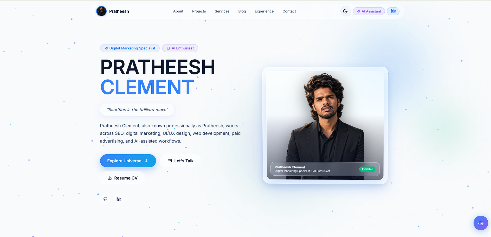

<h1 align="center" style="color:#0F172A;">Pratheesh Clement</h1>

<b>Frontend Developer</b> &nbsp;·&nbsp; <b>Digital Marketing Specialist</b> &nbsp;·&nbsp; <b>AI Enthusiast</b>

<i>Building digital experiences, growth systems, and AI-assisted solutions.</i>

 

## About Me

I'm Pratheesh Clement, a frontend developer and digital marketing specialist working at the intersection of technology, design, growth, and artificial intelligence. My focus is on building clean, performant web experiences with React and TypeScript, while applying an SEO and growth-oriented mindset to how those experiences reach people.

I enjoy turning ideas into modern web products — combining UI/UX, digital marketing, and AI-assisted development workflows to build things that are both well-designed and effective. I'm currently exploring AI engineering, automation, and SaaS product development.

 

## What I Do

<table>
<tr>
<td width="50%" valign="top">

**Frontend Development**

- React &nbsp;·&nbsp; TypeScript &nbsp;·&nbsp; JavaScript
- Responsive web development
- UI implementation
- Web performance

</td>
<td width="50%" valign="top">

**Digital Growth**

- SEO
- Google Ads &nbsp;·&nbsp; Meta Ads
- Analytics & conversion optimization
- Landing pages

</td>
</tr>
<tr>
<td width="50%" valign="top">

**AI & Automation**

- AI-assisted development
- AI workflows & automation
- AI tooling
- Workflow optimization

</td>
<td width="50%" valign="top">

**Product Development**

- Web applications
- SaaS concepts
- Product UX
- Prototyping

</td>
</tr>
</table>

 

## Featured Work

### Personal Portfolio

A modern personal digital ecosystem combining frontend development, UI/UX, digital marketing, SEO, and AI-assisted experiences.

- Responsive interface
- Modern UI/UX
- SEO focused
- Performance focused
- AI-assisted experiences

**Stack:** React · TypeScript · Vite · UI/UX · SEO

 
 

### NET CENTER

A service-first digital marketplace concept designed to connect citizens with digital service providers for assisted digital services.

- Service discovery
- Provider marketplace
- Digital service workflows
- Document handling
- Payment workflow
- Digital assistance
- Product architecture

**Focus areas:** Product Development · SaaS · AI · Full Stack

*Screenshot coming soon.*

 

## Technology

**Frontend**

**Backend & Data**

**Design**

**Development**

**Digital Marketing**

**AI & Automation**

 

## Digital Marketing & Growth

Alongside development, I work across the growth side of digital products — SEO, paid advertising (Google Ads, Meta Ads), landing page design, analytics, and conversion optimization. This lets me approach frontend work not just as UI implementation, but as part of a system built to reach and convert real users.

 

## Currently Exploring

- AI Engineering
- AI-assisted Development
- Automation Systems
- SaaS Product Development
- Advanced Frontend Architecture
- Digital Product Design

 

## GitHub Activity

 

## Let's Connect

Interested in technology, digital products, frontend development, digital marketing, or AI? Let's connect.

 

*Build with purpose. Learn continuously. Improve relentlessly.*

Thanks for visiting my profile.

